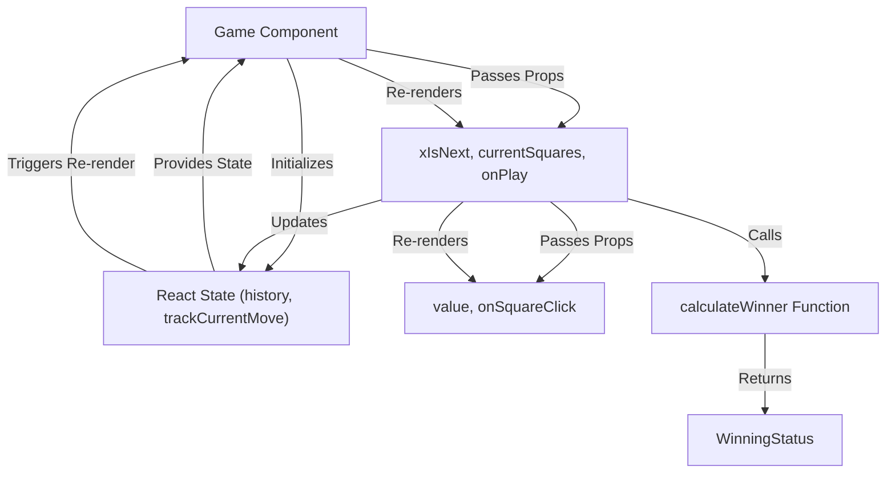

```mermaid
graph TD
  Game["Game Component"]
  State["React State (history, trackCurrentMove)"]
  Board["Board Component"]
  Square["Square Component"]
  Winner["calculateWinner Function"]

  Game -->|Initializes| State
  Game -->|Passes Props| Board[xIsNext, currentSquares, onPlay]
  State -->|Provides State| Game

  Board -->|Passes Props| Square[value, onSquareClick]
  Board -->|Calls| Winner
  Winner -->|Returns| WinningStatus
  Board -->|Updates| State
  State -->|Triggers Re-render| Game
  Game -->|Re-renders| Board
  Board -->|Re-renders| Square
```