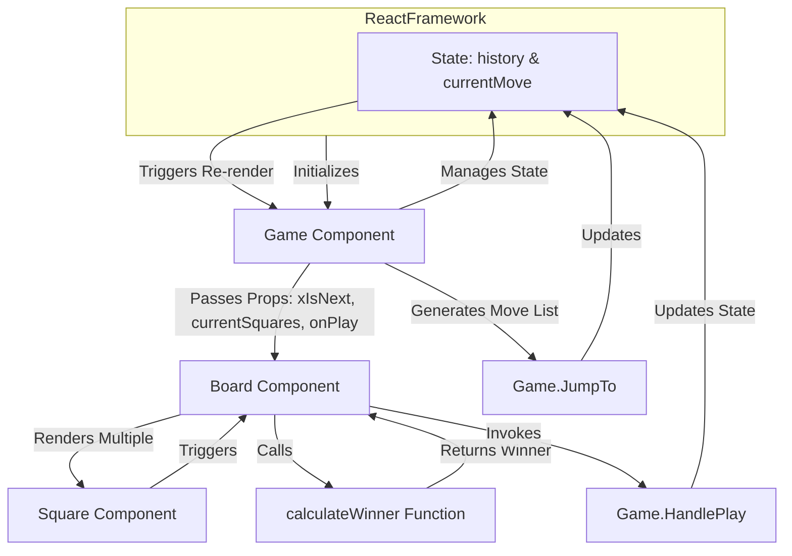

```mermaid
graph TD
  subgraph ReactFramework
    State[State: history & currentMove]
  end

  Game["Game Component"]
  Board["Board Component"]
  Square["Square Component"]
  CalculateWinner["calculateWinner Function"]

  %% Game Initialization
  ReactFramework -->|Initializes| Game
  Game -->|Manages State| State

  %% Data Flow
  Game -->|Passes Props: xIsNext, currentSquares, onPlay| Board
  Board -->|Renders Multiple| Square
  Square -->|Triggers| Board

  %% Winner Calculation
  Board -->|Calls| CalculateWinner
  CalculateWinner -->|Returns Winner| Board

  %% State Updates
  Board -->|Invokes| Game.HandlePlay
  Game.HandlePlay -->|Updates State| State
  State -->|Triggers Re-render| Game

  %% Moves List
  Game -->|Generates Move List| Game.JumpTo
  Game.JumpTo -->|Updates| State
```
