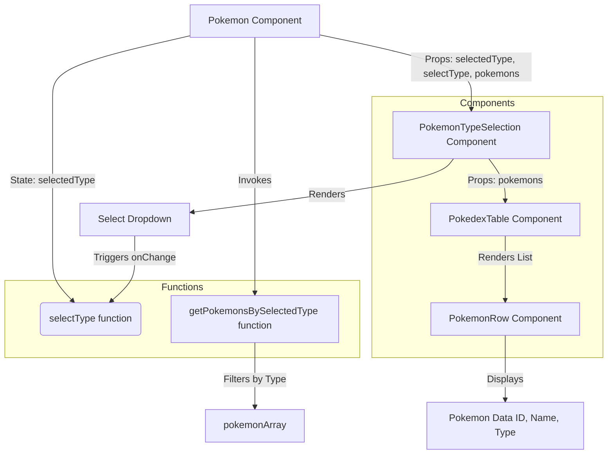

Below is the data flow diagram for the PokemonTypeSelection component.

```mermaid
graph TD
    A[Pokemon Component] -->|State: selectedType| B(selectType function)
    A -->|Invokes| C[getPokemonsBySelectedType function]
    C -->|Filters by Type| D[pokemonArray]
    A -->|Props: selectedType, selectType, pokemons| E[PokemonTypeSelection Component]

    E -->|Renders| F[Select Dropdown]
    F -->|Triggers onChange| B

    E -->|Props: pokemons| G[PokedexTable Component]
    G -->|Renders List| H[PokemonRow Component]
    H -->|Displays| I[Pokemon Data ID, Name, Type]

    subgraph Functions
        B
        C
    end

    subgraph Components
        E
        G
        H
    end
```
